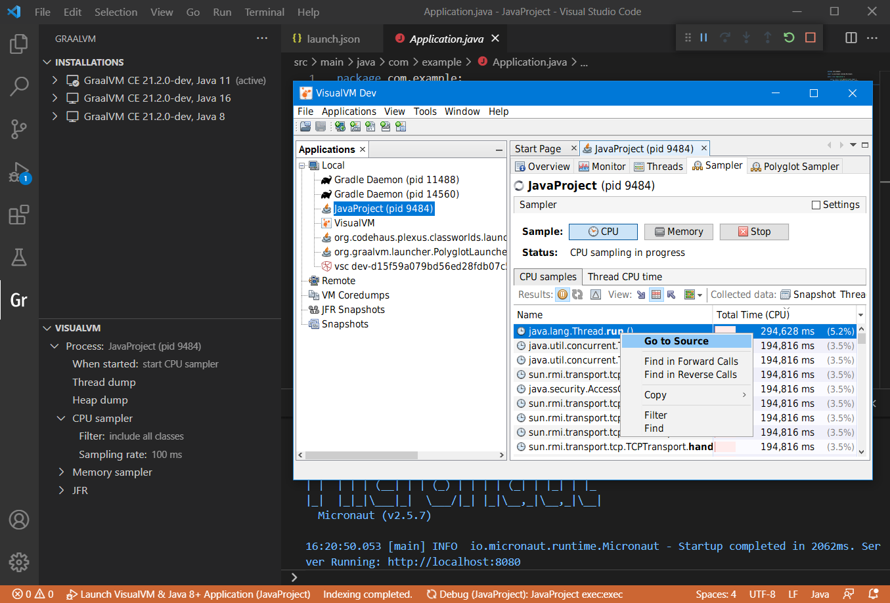
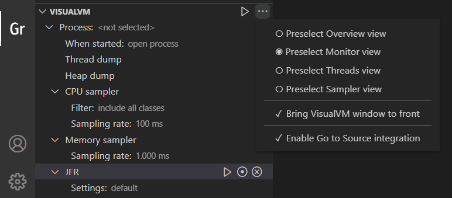
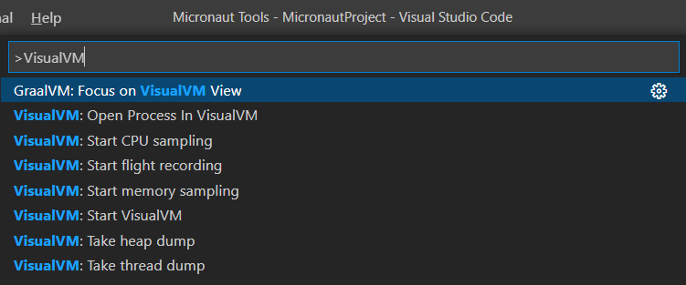

# VisualVM and VS Code Integration

GraalVM Tools for Java extension provides integration with [VisualVM](https://visualvm.github.io), which is the all-in-one Java (and polyglot) monitoring and troubleshooting tool.
This brings the visual Java tooling to VS Code.

A special launch configuration, **Launch VisualVM & Java 8+ Application**, is provided by the GraalVM Tools for Java extension to start VisualVM along with the project.
To get started, do the following:

1. Click **Gr** in the activity panel, install the latest GraalVM release, and activate it, as described [here](README.md#graalvm-installation-wizard).
2. Create the _launch.json_ file. If not already created, create a new `launch.json` file from the **Run and Debug** activity using the create a launch.json file link. Select the Java 8+ environment when asked.
3. Open `launch.json` and click the **Add Configuration…** button in the bottom right corner of the editor. Select the **GraalVM: Launch Java 8+ Application with VisualVM** configuration. Make sure to save the `launch.json` file after editing.
4. Select the action to perform when project starts. In the VisualVM pane of the **Gr** activity view, click the **Configure** action to define the action to perform when the project is started.
5. Select the **Launch VisualVM & Java 8+ Application** launch configuration in the **Run and Debug** activity. Use the **Start Debugging** or **Run Without Debugging** action to start the current project.

While the project is starting, the Process node in VisualVM pane displays the project name with a "pid pending" label.
Once the project process starts, the Process node is updated to show its process ID (PID) and the action defined in step 3 is performed.

## VisualVM Pane

The VisualVM pane provides the following actions and features:

**Start VisualVM**

The action to start the VisualVM tool is bundled with an active GraalVM installation.
If a process has already been selected for monitoring, VisualVM opens the process view at the defined tab.
If a process selected for monitoring is not running any more, invoking the action just clears the process selection and shows a notification.
Subsequent action invocation starts VisualVM again without a process context.

**More Actions... -> Preselect [Overview/Monitor/Threads/Sampler] view**

The choices to define which tab will be selected when opening the process view.

**More Actions... -> Bring VisualVM window to front**

When selected, the VisualVM window is made the topmost window every time an action is invoked on VisualVM.
It may have no effect in certain window systems.

**More Actions... -> Enable Go to Source integration**

Only available when there is a project open in VS Code.
When selected, the VisualVM is configured to open source code back in VS Code editor on **Go to Source** action invocation in various VisualVM views.
The VisualVM **Options | Sources** settings are populated by the current project's source roots, active GraalVM installation sources, and VS Code is set to be the _sources viewer_.

Note that **Go to Source** in VisualVM will open sources defined in the VS Code project and the active GraalVM sources.
Sources of the project libraries and other dependencies cannot be opened from VisualVM.
Unselect the **Enable Go to Source** integration choice to enable manual source roots and sources viewer definition in VisualVM **Options | Sources** settings.

> Note: **Go to Source** action is currently not available in some VisualVM views and has some limitations for certain Java language features. [See Sources Support](https://visualvm.github.io/sourcessupport.html) for details.

**Process**

A node to track the process selected for monitoring by VisualVM.
By default no process is selected, showing the _not selected_ value.
A process can be selected for monitoring using the **Select process** action available for the Process node, by invoking any action which requires the process selection, using the **Open Process In VisualVM** in Command Palette, or by starting the project using the special **Launch VisualVM & Java 8+ Application** launch configuration.

When selecting a process for monitoring, list of local Java processes started by the current user is displayed (populated using the `jps` tool from the active GraalVM).
For each process the main class is displayed if available, along with the process ID.
If the process is configured to display a custom name in VisualVM (`-Dvisualvm.display.name=CustomName`), the custom name is displayed instead of the main class.
Each process item also shows a fully qualified main class name together with the arguments passed to the process, if available.

Once the selected process has terminated, the node is cleared on first invocation of either Start VisualVM or any action which requires the process selection.

**When Started**

A node to define the action to perform when the process is started.
This feature requires starting the project using the **Launch VisualVM & Java 8+ Application** launch configuration.
The following choices are available:

* **Do nothing**: no action is taken when the process is started
* **Open process**: the process is opened in VisualVM and the defined tab is selected
* **Start CPU sampler**: the process is opened in VisualVM, the Sampler tab is selected, and the CPU sampling session is started using the defined settings
* **Start Memory sampler**: the process is opened in VisualVM, the Sampler tab is selected, and the memory sampling session is started using the defined settings
* **Start JFR recording**: the process is opened in VisualVM, and the flight recording is started using the defined settings

By default, the Open process choice is selected.
This means that once the project process is started (using the **Launch VisualVM & Java 8+ Application** launch configuration), VisualVM is started as well, the project process is opened, and defined tab selected. Use the **Configure** action to change the default choice.

**Thread Dump**

A node and action to take and display a thread dump from the process selected for monitoring.
Process selection will be requested if no process has been selected for monitoring yet.
If the process selected for monitoring is not running any more, invoking the **Take thread dump** action just clears the process selection and shows a notification.
Subsequent action invocation will request another process selection.

**Heap Dump**

A node and action to take and display a heap dump from the process selected for monitoring.
Process selection will be requested if no process has been selected for monitoring yet.
If the process selected for monitoring is not running any more, invoking the **Take heap dump** action just clears the process selection and shows a notification.
Subsequent action invocation will request another process selection.

**CPU Sampler**

A node and actions to start, snapshot, and stop the CPU sampling session using the defined settings for the process selected for monitoring.
Process selection will be requested if no process has been selected for monitoring yet.
If the process selected for monitoring is not running any more, invoking the CPU sampler actions just clears the process selection and shows a notification.
Subsequent actions invocation will request another process selection.

The following actions are available for the CPU sampler:

* **Start CPU sampling**: starts a new CPU sampling session if not already running, using the defined settings, and opens the process in VisualVM at the Sampler tab
* **Take snapshot of sampler results**: takes and displays a results snapshot if the CPU sampling session is already running and some results have been collected so far
* **Stop sampling**: stops the CPU sampling session if running
The CPU sampler node can be further expanded to access the CPU sampling settings.
The following settings can be configured using the Configure action:

  - **Filter**

  A definition of the CPU sampling filter. The filter controls which data are collected by the CPU sampler, and will be available for analysis in the live results and snapshot. The following choices are available:

    * **Include all classes**: data from all classes are collected, including project classes, classes of project libraries and other dependencies, and JDK classes
    * **Exclude JDK classes**: data from all classes are collected, except of the JDK classes (like `java.*`, `com.sun.*`, `org.graalvm.*`, etc.)
    * **Include only project classes**: only data from classes defined by the current project are collected

  By default, Include all classes choice is selected.
  Typically, this is an optimal choice, as the sampler results can be further filtered using custom filters once collected.

  - **Sampling rate**
  Definition of the CPU sampling rate.
  The sampling rate controls which methods are "visible" to the sampler engine - the higher the sampling rate is, the shorter executing methods can be tracked, but the higher overhead is imposed to the monitored process, and its execution biased. Available values are 20 ms - 10.000 ms.
  By default, 100 ms value is selected.
  Typically, this is the optimal choice when searching for a performance bottleneck, while letting the process run at almost full speed.

**Memory Sampler**

A node and actions to start, snapshot, and stop the memory sampling session using the defined settings for the process selected for monitoring.
Process selection will be requested if no process has been selected for monitoring yet.
If the process selected for monitoring is not running any more, invoking the Memory sampler actions just clears the process selection and shows a notification.
Subsequent actions invocation will request another process selection.

The following actions are available for the Memory sampler:

* **Start memory sampling**: starts a new memory sampling session if not already running, using the defined settings, and opens the process in VisualVM at the Sampler tab
* **Take snapshot of sampler results**: takes and displays a results snapshot if the memory sampling session is already running and some results have been collected so far
* **Stop sampling**: stops the memory sampling session if running

The Memory sampler node can be further expanded to access the memory sampling settings.
The following settings can be configured using the Configure action:

  - **Sampling rate**
  Definition of the memory sampling rate.
  The sampling rate controls how frequently a class histogram will be obtained from the process and displayed in VisualVM. Available values are 100 ms - 10.000 ms. By default, 1.000 ms value is selected.
  Typically, this is an optimal choice for evaluating which classes and instances are currently allocated on heap and whether they are eventually released at the expected time.

**JDK Flight Recorder**

A node and actions to start, dump, and stop the JDK Flight Recorder (JFR) session using the defined settings for the process selected for monitoring.
Process selection will be requested if no process has been selected for monitoring yet.
If the process selected for monitoring is not running any more, invoking the JFR actions just clears the process selection and shows a notification.
Subsequent actions invocation will request another process selection.

The following actions are available for the JFR:

* **Start flight recording**: starts a flight recording session if not already running, using the defined settings, and opens the process in VisualVM at the defined tab
* **Dump flight recording data**: dumps and displays the flight recording data collected so far if the flight recording session is already running
* **Stop flight recording**: stops the flight recording session if running

The JFR node can be further expanded to access the flight recorder settings.
The following settings can be configured using the Configure action:

  - **Settings**
  Definition of the flight recorder configuration.
  Flight recorder configurations control the amount of data that is recorded by defining settings for each event type.
  The following predefined configurations are available:

    * default - collect a predefined set of information with low overhead
    * profile - collect more data than the default settings, but with more overhead and impact on performance
  By default, the default configuration is selected.
  Typically, this is an optimal choice for evaluating the behavior of the monitored process.

> Note: If the current active GraalVM installation is older than GraalVM 21.2.0, only the Process node and When started node are available in the VisualVM pane. The When started node only provides Do nothing and Open process choices. More actions... menu does not provide the Bring VisualVM to front and Enable Go to Source integration actions. Make sure to use the most recent GraalVM release to access all features.

## Available Commands

The following quick actions related to VisualVM become available if you install active the most recent GraalVM in VS Code:

> Note: If the current active GraalVM installation is older than GraalVM 21.2.0, only the **VisualVM: Start VisualVM**, and **VisualVM: Open Process In VisualVM** commands are available from the Command Palette. Upgrade GraalVM to the latest release.

**VisualVM: Start VisualVM**

Start the VisualVM tool bundled with the active GraalVM installation.
If a process has already been selected for monitoring, VisualVM opens the process view at the defined tab.
If the process selected for monitoring is not running any more, invoking the action just clears the process selection and shows a notification.
Subsequent action invocation starts VisualVM again without a process context.

**VisualVM: Open Process In VisualVM**

Request process selection and opens the selected process in VisualVM at the defined tab.

**VisualVM: Take thread dump**

Take and display a thread dump from the process selected for monitoring.
Process selection will be requested if no process has been selected for monitoring yet.
If the process selected for monitoring is not running any more, invoking the **Take thread dump** action just clears the process selection and shows a notification.
Subsequent action invocation will request another process selection.

**VisualVM: Take heap dump**

Take and display a heap dump from the process selected for monitoring.
Process selection will be requested if no process has been selected for monitoring yet.
If the process selected for monitoring is not running any more, invoking the **Take heap dump** action just clears the process selection and shows a notification.
Subsequent action invocation will request another process selection.

**VisualVM: Start CPU sampling**

Start a new CPU sampling session for the process selected for monitoring, if not already running, using the defined settings, and open the process in VisualVM at the Sampler tab.
Process selection will be requested if no process has been selected for monitoring yet.
If the process selected for monitoring is not running any more, invoking the **Start CPU sampling** action just clears the process selection and shows a notification.
Subsequent action invocation will request another process selection.

**VisualVM: Start memory sampling**

Start a new memory sampling session for the process selected for monitoring, if not already running, using the defined settings, and open the process in VisualVM at the Sampler tab.
Process selection will be requested if no process has been selected for monitoring yet.
If the process selected for monitoring is not running any more, invoking the **Start memory sampling** action just clears the process selection and shows a notification.
Subsequent action invocation will request another process selection.

**VisualVM: Start flight recording**

Start a flight recording session for the process selected for monitoring, if not already running, using the defined settings, and opens the process in VisualVM at the defined tab.
Process selection will be requested if no process has been selected for monitoring yet.
If the process selected for monitoring is not running any more, invoking the **Start flight recording** action just clears the process selection and shows a notification.
Subsequent action invocation will request another process selection.
